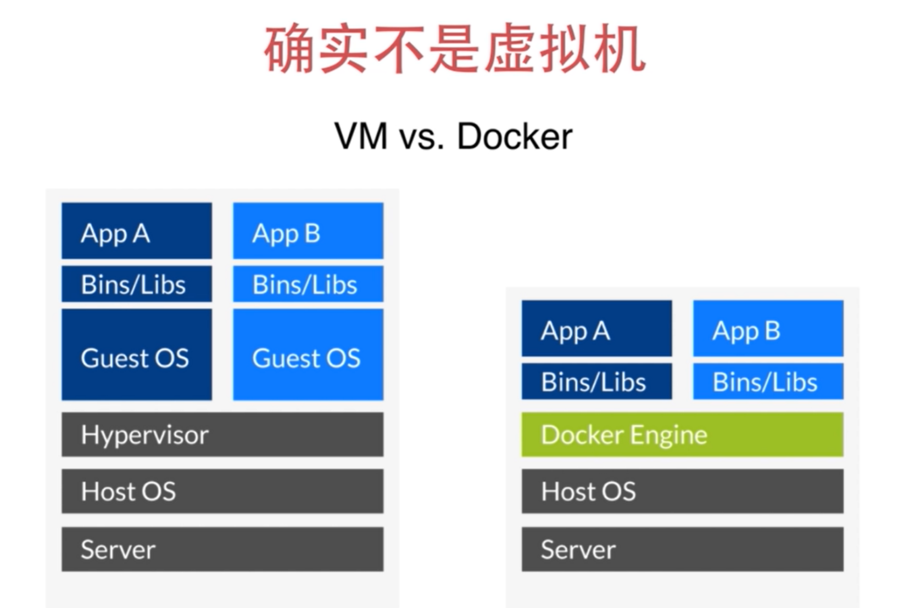
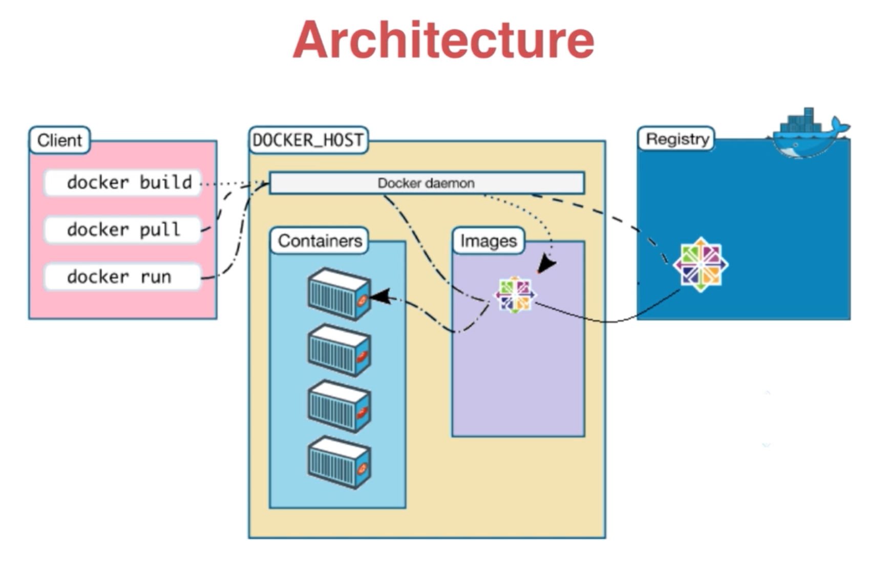
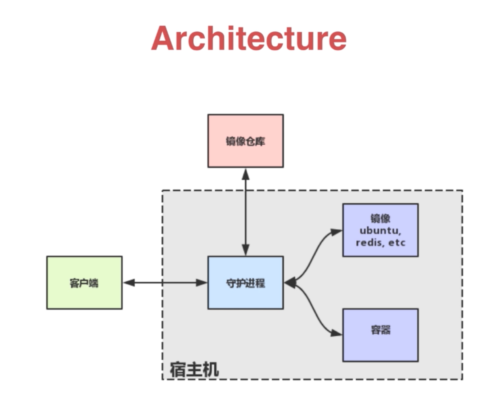

# Docker

## Docker简介

可以粗糙的理解为轻量的虚拟机

开挂的chroot,choot对应用c程序做了文件系统的分离

虚拟机与docker的区别

	


## Windows安装

```shell
 sudo choco install docker -y
 docker -v
```

## Linux安装

```shell
 sudo apt install docker.io -y
 docker -v
```


## Docker架构介绍与实战




`Docker daemon`

​	Docker daemon为docker的核心，主要负责下载docker镜像,运行容器。

`Client`

​	与Docker deamon交互的工具，将docker build,docker pull,docker run交给docker deamon做实际的操作。

`Registry`

​	互联网的Sass服务，可以通过这个服务获取镜像，或者推送镜像。是所有docker玩家共享docker镜像的一个服务。




​	客户端与守护进程进行交互，守护进程负责运行容器，从镜像仓库获取镜像。


### 运行一个简单的ubuntu容器

```shell
docker run ubuntu echo hello docker
```

