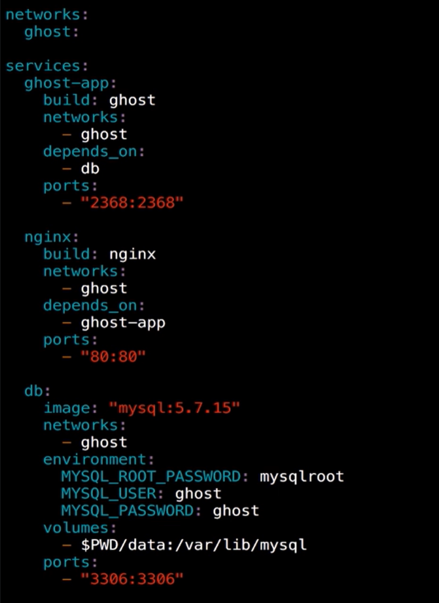

# Docker

## Docker简介

可以粗糙的理解为轻量的虚拟机

开挂的chroot,choot对应用c程序做了文件系统的分离

虚拟机与docker的区别

	


## Windows安装

```shell
 sudo choco install docker -y
 docker -v
```

```shell
去https://hub.docker.com/下载安装
```


## Linux安装

```shell
 sudo apt install docker.io -y
 docker -v
```


## Docker架构介绍与实战


`Docker daemon`

​	Docker daemon为docker的核心，主要负责下载docker镜像,运行容器。

`Client`

​	与Docker deamon交互的工具，将docker build,docker pull,docker run交给docker deamon做实际的操作。

`Registry`

​	互联网的Sass服务，可以通过这个服务获取镜像，或者推送镜像。是所有docker玩家共享docker镜像的一个服务。


​	客户端与守护进程进行交互，守护进程负责运行容器，从镜像仓库获取镜像。


### 运行一个简单的ubuntu容器

```shell
# 运行ubnutu容器,并在屏幕输出hello docker
$ docker run ubuntu echo hello docker
# 查看docker拥有的镜像
$ docker images

# 运行nginx容器 -p 将容器的80端口转到本地的8080端口  -d 以守护进程的方式运行(挂起)
$ docker run -p 8080:80 -d daocloud.io/nginx

# 查看当前正在运行的docker容器
$ docker ps

CONTAINER ID   IMAGE               COMMAND                  CREATED       STATUS          PORTS                  NAMES
ade5a1dbd28b   daocloud.io/nginx   "/docker-entrypoint.…"   5 hours ago   Up 34 seconds   0.0.0.0:8000->80/tcp   laughing_gates

# 可以通过浏览器访问http://localhost:8080访问nginx主页

# 将自己写的网站index.html放到镜像的nginx中
$ docker cp index.html ade5a1dbd28b://usr/share/nginx/html

# 通过浏览器访问http://localhost:8080即可访问index.html中的内容

# 暂时停止容器
$ docker stop ade5a1dbd28b

# 保存对容器的改动,此命令会产生一个name为nginx-index的新images
$ docker commit -m 'add index' ade5a1dbd28b nginx-index

# 列出所有运行过的容器
$ docker ps -a

# 删除运行过的容器记录
$ docker rm ade5a1dbd28b ade5a1dbd281


```


###   docker命令小结


## Dockerfile

通过编写简单的文件自创docker镜像,无需通过docker commit命令

### 简单的Dockerfile

Dockerfile文件:

```dockerfile
# FROM:设置基础镜像
FROM alpine:latest
# MAINTAINER:  备注镜像维护者
MAINTAINER watermelon
# CMD: 镜像启动时需要运行的命令
CMD echo 'hello docker'
```

通过docker build根据Dockerfile来创建镜像

```shell
# 创建镜像 -t是设置TAG的意思,可以在docker images的TAG栏里找到, .代表当前路径的dockerfile文件,一定要用.
$ docker build -t hello_docker .

# 列出所有镜像
$ docker images
REPOSITORY          TAG       IMAGE ID       CREATED          SIZE
dockerfile1         latest    d245e3061525   9 days ago       5.54MB

# 运行创建的镜像
$ docker run dockerfile1
hello docker
```


### 复杂的Dockerfile

```dockerfile
FROM ubuntu
MAINTAINER watermelon
# RUN: 镜像创建时需要运行的命令
RUN apt-get update
RUN apt-get install -y nginx
# COPY: 将本地的文件复制到镜像中
COPY index.html /var/www/html
# ENTRYPOINT: 镜像启动时需要运行的命令
ENTRYPOINT ["/usr/sbin/nginx","-g","daemon off;"]
# 告诉运维人员,这个镜像需要打开哪些端口,并不会真正打开端口
EXPOSE 80
```


通过docker build根据Dockerfile文件来创建镜像

```shell
# 构建镜像
$ docker build -t watermelon/nginx01 .

# 运行镜像
$ docker run -d -p 8000:80 watermelon/nginx01
```


### docker分层


## Volume存储

可提供独立于容器之外的持久化存储


```shell
# 运行一个nginx容器
docker run -d --name nginx -v /usr/share/nginx/html nginx
# nginx检查,可以给出容器所有的信息
docker inspect nginx

# 进入容器
docker exec -it nginx /bin/bash
```


通过docker inspect nginx获取容器与宿主机的挂载路径


注意:mac还有一个容器层,需要通过screen命令进入


### 将宿主目录挂载到容器中

容器中是没有这个目录的.也就是没有html这个目录,也进不去

```shell

# 把当前目录的/html目录挂载到nginx容器的/usr/share/nginx/html目录中去
# $PWD是shell语法,代表当前目录
$ docker run -p 8000:80 -d -v $PWD/html:/usr/share/nginx/html nginx
```

### 将宿主目录挂载到多个容器中

容器中是有这个目录的,也能进去这个目录

通过这种方式,可以将一个目录挂载到多个目录

```shell
# 创建一个仅有数据的容器,将数组的/data目录挂载到容器的/var/mydata中
$ docker create -v $PWD/data:/var/mydata --name data_container ubuntu

# 以交互的模式进入到容器中
$ docker run -it --volumes-from data_container ubuntu /bin/bash

```

## Registry镜像


### 交互命令

```shell
#搜索镜像
docker search whalesay

#拉取镜像
docker pull whalesay

#将本地镜像push到仓库中
docker push myname/whalesay

#使用whalesay程序
docker run docker/whalesay cowsay Docker很好玩!

#给本地镜像打tag
docker tag docker/whalesay watermelon/whalesay

#docker登录
docker login


```


### 国内的docker仓库

daocloud


时速云


aliyun


## compose多容器应用

windows,mac在安装docker时已经自带了componse

### linux安装docker compose


### 通过compose部署一个多容器的应用

创建ghost目录

​    创建Dockerfile文件


​    创建配置文件config.js


 

​    准备docker-compose.yml文件



 

创建nginx目录

  Dockerfile


​    创建nginx.conf


创建data目录

 

 

 

通过compose启动docker服务

$ docker-compose up -d

通过compose停止docker服务

$ docker-compose stop

 

通过compose删除docker容器

$ docker-compse rm

 

通过compose重新构建docker容器,构建完再通过up命令启动服务

$ docker-compose build

 

 

### compose常用命令


 
